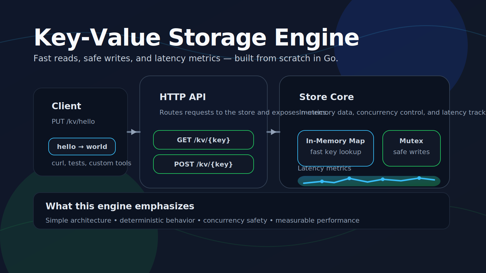
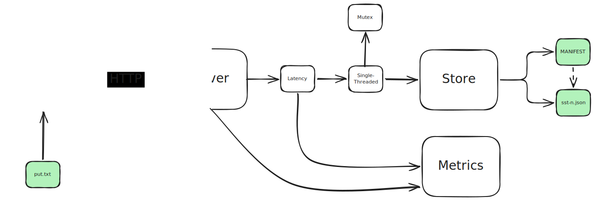

# Build Your Own Key-Value Storage Engine



## Versions

1. [Week 1: In-Memory Store](https://github.com/mfcollins3/coding-corner-kv-store/tree/week-1)
2. [Week 2: LSM Tree Foundations](https://github.com/mfcollins3/coding-corner-kv-store/tree/week-2)

## Table of Contents

1. [About](#about)
2. [Features](#features)
3. [Tech Stack](#tech-stack)
4. [Architecture](#architecture)
5. [Project Structure](#project-structure)
6. [Getting Started](#getting-started)
7. [Configuration](#configuration)
8. [Security](#security)
9. [Contributing](#contributing)
10. [What's Next](#whats-next)

## About

This repository contains my implementation for the
[Build Your Own Key-Value Storage Engine](https://read.thecoder.cafe/p/build-your-own-kv-engine)
article series published to [The Coding Corner](https://read.thecoder.cafe/s/coding-corner)
on [The Coder Cafe](https://read.thecoder.cafe/). The article series was written
by [Teiva Harsanyi](https://substack.com/@teivah) to show developers how to
implement a key-value storage engine from scratch. The article series starts
with a simple in-memory storage engine and over the eight articles, it adds
persistence, write-ahead logging, indexing, and concurrency to the engine.

This repository contains my implementation of the key-value storage engine based
on the article series. The implementation is written in [Go](https://go.dev). My
implementation achieves all the goals in the article series, including optional
goals, but also adds on some additional features such as concurrency and
additional requirements on the HTTP APIs.

## Features

| Feature                     | Description                                                                                                                                                                           |
|-----------------------------|---------------------------------------------------------------------------------------------------------------------------------------------------------------------------------------|
| Efficient Memory Management | The engine stores key-value pairs in memory for fast access. When the in-memory store grows to a specific size, the key-value pairs are written to a sorted-string table (SSTable) file on disk. |
| Persistence                 | Key-value pairs are persisted to disk in a sorted-string table (SSTable) file. If the key is not found in memory, the SSTable files are searched in reverse order (newest to oldest) to find the key-value pair. |
| Single Threaded             | The engine protects against dirty reads and writes by using a mutex to allow concurrent reads and exclusive writes.                                                                   |
| Metrics                     | The engine exposes P50, P95, and P99 latency metrics for key-value storage engine requests via the `/metrics` endpoint.                                                               |

## Tech Stack

| Layer | Technology | Purpose                                                                                                                                                                                   |
| --- | --- |-------------------------------------------------------------------------------------------------------------------------------------------------------------------------------------------|
| Language | [Go](https://go.dev) | Go was chosen to implement the key-value storage engine because it's powerful, but simple and readable even for developers that do not know Go. It also works across all major platforms. |
| HTTP Server | [Standard Library](https://pkg.go.dev/net/http) | The Go standard library provides a simple and efficient HTTP server implementation that is easy to use and configure. It also works across all major platforms. |
| Unit Testing | [Standard Library](https://pkg.go.dev/testing) | The Go standard library provides a simple and efficient unit testing framework that is easy to use and configure. It also works across all major platforms. |
| Mocking and Assetions | [Testify](https://pkg.go.dev/github.com/stretchr/testify) | Testify is a popular Go testing framework that provides easy-to-use mocking and assertion capabilities. It also works across all major platforms. |

## Architecture



## Project Structure

```plain
kvstore/
|-- assets/                 # Contains assets such as diagrams and pictures for the README.md document and other documents
|-- cmd/                    # Contains the executable programs for this project
    |-- client/             # Contains the client program that is used to test the key-value storage engine
    |-- gen/                # Contains the test data generator program that is used to create test data for the client program to send to the key-value storage engine
    |-- server/             # Contains the server program that hosts the key-value storage engine's API as REST endpoints
|-- internal/               # Contains the implementation of the key-value storage engine
    |-- api/                # Contains the HTTP handlers that implement the REST APIs for the key-value storage engine
        get_metrics.go      # Implements the GET /metrics endpoint that returns latency metrics for the key-value storage engine
        get_value.go        # Implements the GET /kv/{key} endpoint that returns the value for a given key
        set_value.go        # Implements the POST /kv/{key} endpoint that sets the value for a given key
    |-- kvstore/            # Contains the implementation of the key-value storage engine
        api_injectors.go    # Implements variables that reference standard library functions that need to be replaced for testing purposes (e.g., os.OpenFile can be replaced to simulate errors for testing)
        lsm_tree_store.go   # Implements the LSM tree key-value storage engine
        manifest.go         # Reads and writes the MANIFEST file that contains the list of SSTable files
        memtable.go         # Implements the in-memory key-value store
        sstable.go          # Implements the sorted-string table (SSTable) file format for persisting key-value pairs to disk or searching an SSTable file for a key-value pair
        store.go            # Defines the interface for the key-value storage engine
    |-- metrics/            # Contains the implementation of the latency metrics for the key-value storage engine
        histogram.go        # Implements a histogram to track latency metrics for the key-value storage engine
        percentiles.go      # DTO for returning the latency percentiles for the key-value storage engine
|-- .gitattributes          # Git attributes file to define how Git should handle certain files in the repository
|-- .gitignore              # Git ignore file to define which files and directories should be ignored by Git
|-- go.mod                  # Go module file to define the module path and dependencies for the project
|-- go.sum                  # Go checksum file to define the checksums for the dependencies used in the project
|-- LICENSE.md              # License file for the project, which defines the terms under which the project can be used, modified, and distributed
|-- README.md               # This file, which provides an overview of the project, its features, architecture, and project structure
```

## Getting Started

### Prerequisites

* **[Go](https://go.dev)**: 1.26 or higher
* **[Git](https://git-scm.com)**
* **[GitHub CLI](https://cli.github.com)** (optional, but recommended)
* **[curl](https://curl.se)** (optional, but recommended)

### 1. Clone the Repository

If you are using GitHub CLI, you can clone the repository using the following
command:

```shell
gh repo clone mfcollins3/coding-corner-kv-store
cd coding-corner-kv-store
go mod download
```

If you are using Git, you can clone the repository using the following command:

```shell
git clone https://github.com/mfcollins3/coding-corner-kv-store.git
cd coding-corner-kv-store
go mod download
```

### 2. Run the Unit Tests

```shell
go test ./...
```

### 3. Generate Test Data

```shell
go run ./cmd/gen put 30000
```

### 4. Start the Key-Value Storage Engine Server

```shell
go run ./cmd/server
```

### 5. Store a Value in the Key-Value Storage Engine

To store the value `world` for the key `hello`, run the following command:

```shell
curl -X PUT http://localhost:8080/kv/hello \
    -H "Content-Type: text/plain" \
    -d "world"
```

### 6. Read a Value from the Key-Value Storage Engine

```shell
curl http://localhost:8080/kv/hello
```

### 7. Start the Key-Value Storage Engine Client

In a separate terminal, run the following command to start the client program
and send the test data to the key-value storage engine server:

```shell
go run ./cmd/client
```

### 8. Request the P50, P95, and P99 Latency Metrics

```shell
curl http://localhost:8080/metrics
```

## Configuration

No configuration is required to run the key-value storage engine. The server
will start listening for requests on port 8080 by default.

## Security

There is no authentication, authorization, or encryption implemented in the
key-value storage engine. The engine is intended for educational purposes only 
and should not be used in production environments. The engine is intended to be
used for `localhost` testing only and should not be exposed to the Internet.

## Contributing

This project is open source and intended to be educational in nature. If you see
a bug and want to fix it, feel free to send a pull request. My recommendation is
that you follow the article series and implement your own key-value storage
engine from scratch. You can then compare your implementation to mine and see 
how they differ, or use my implementation as a reference to help you implement
your own key-value storage engine.

## What's Next

The current implementation of the key-value storage engine implements an 
[LSM Tree](https://read.thecoder.cafe/p/lsm-trees) for managing the key-value 
pairs. A small subset of recent updates are kept in memory. When the in-memory 
set grows too big, the key-value pairs are flushed and persisted to disk. If a 
key can't be found in the in-memory store, then the SSTables are searched from 
newest to oldest until the key is found. The following features are coming soon:

- [ ] [Durability with Write-Ahead Logging](https://read.thecoder.cafe/p/build-your-own-kv-engine-3)
- [ ] [Deletes, Tombstones, and Compaction](https://read.thecoder.cafe/p/build-your-own-kv-engine-4)
- [ ] [Leveling and Key-Range Partitioning](https://read.thecoder.cafe/p/build-your-own-kv-engine-5)
- [ ] [Block-Based SSTables and Indexing](https://read.thecoder.cafe/p/build-your-own-kv-engine-6)
- [ ] [Bloom Filter and Trie Memtable](https://read.thecoder.cafe/p/build-your-own-kv-engine-7)
- [ ] [Concurrency](https://read.thecoder.cafe/p/build-your-own-kv-engine-8)

## License

This project is licensed under the MIT License. See the [LICENSE.md](LICENSE.md)
file for details.

## Acknowledgements

* [Teiva Harsanyi](https://substack.com/@teivah) for writing the article series 
  and providing the inspiration for this project.

## Author

[**Michael Collins**](mailto:mfcollins3@me.com)

[](https://github.com/mfcollins3)
[](https://www.linkedin.com/in/michaelfcollins3/)
[](https://www.youtube.com/@mfcollins3)

